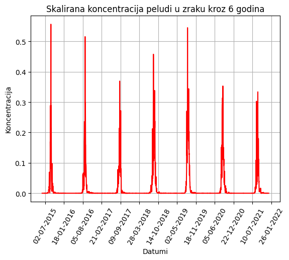
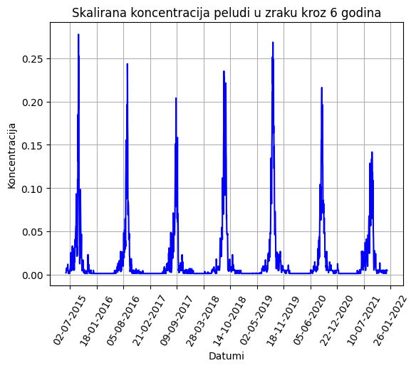
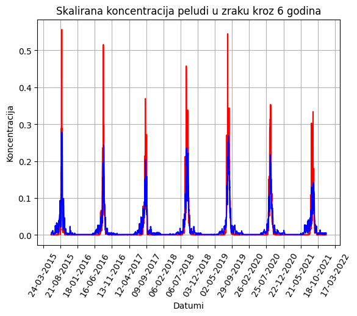
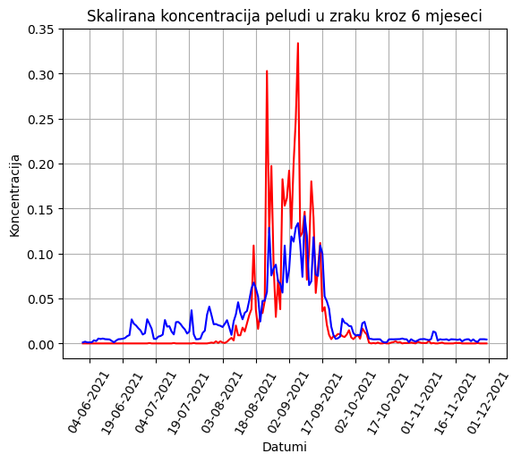

# LSTM Model for Pollen Concentration Prediction

This README file provides an overview of the Long Short-Term Memory (LSTM) model developed for predicting pollen concentration. Pollen concentration prediction is a valuable task for individuals who suffer from pollen allergies, as it can help them plan their activities and take preventive measures.

## Table of Contents
1. **Introduction**
2. **Dataset**
3. **Model Architecture**
4. **Requirements**
5. **Usage**
6. **Results**


---

## 1. Introduction

The LSTM model for pollen concentration prediction is designed to forecast the future pollen concentration levels based on historical data. This model is a type of recurrent neural network (RNN) that is particularly suited for sequential data and time series forecasting.

## 2. Dataset

To train and evaluate the LSTM model, you will need a dataset that includes historical pollen concentration data. The dataset is stored in an Excel spreadsheet. The data used in this model were collected using air particle measurement devices as part of the RealForAll project (https://www.realforall.com/language/en/welcome/). Our dataset contains 21 features (columns) and  8036 entries (rows). Rows repesents period of 21 years from 1.1.2000. to 31.12.2020. Our columns are:

- RA – rain (yes/no, or 1/0)
- SN – snow (1/0)
- TS – thunderstorm (1/0)
- FG – fog (1/0)
- MBV – maximum wind speed
- SBV – average wind speed
- PAD – precipitation
- VLZ – air humidity
- ATT – atmospheric pressure
- MNT – minimum daily temperature
- MKT – maximum daily temperature
- SRT – average daily temperature
- GOD – year
- MSC – month
- DAN – day
- RBD – ordinal day of the year
- LOK – location
- PRAM – average ragweed concentration
- PRBR – average birch pollen concentration
- PRTR – average grass pollen concentration
- DAT - date


## 3. Model Architecture

The LSTM model used for pollen concentration prediction consists of the following components:

- **LSTM Layer:** Where the input size is 17, which is the number of features (17), the size of the hidden layer is set to 512. Additionally, we specified that the model would use a bias.

- **Dropout Layer** 

- **Linear Layer** 

- **Loss Function:** Mean squared error (MSE) for regression tasks.

- **Optimizer:** Adam.

## 4. Requirements

To run the LSTM model for pollen concentration prediction, you will need the following libraries and tools:

- Python - version (3.8.8)
- PyTorch (for building and training the model) - version (2.0.1)
- Pandas (for data manipulation) - version (2.0.3)
- NumPy (for numerical operations) - version (1.24.4)
- Scikit-learn (for loss function) - version (1.1.2)
- Matplotlib (for visualization) - version (3.6.0)
- Jupyter Notebook

## 5. Usage

Clone this repository to your local machine and install the required dependencies using `pip` or `conda`.

```
git clone https://github.com/DinoSarlija/LSTM_pellon.git
cd LSTM_pellon
pip install -r requirements.txt
```

## 6. Results
We achieved the best result for a 5-day period, where our highest accuracy was 70.17%. In this case, the data were not filtered, we applied a 25% dropout rate, the learning rate was set at 0.01, and we obtained the result after 1000 epochs.

 







